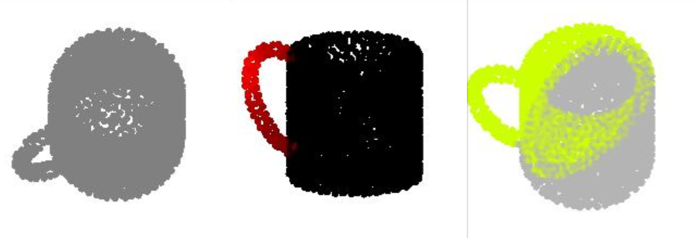

# Neural Point Cloud Highlighting of Affordance Region [Politecnico di Torino 2025]

*Lukas Loiodice (s334726), Louise Tiger (s33527) & Antoine Wencel (s321430)*

Politecnico di Torino

Introduction: *This paper aims to present our exploration, implementation and propositions of extension of the 3D highlighter developed by students from the University of Chicago. The goal of the project was to build a label-free pipeline for affordance generation on point cloud in a zero-shot fashion,leveraging pre-trained language vision models.*




### Run Examples

To run the experiments on google colab, you can copy the project on your drive and copy past the code below.
```
# Mount Google Drive
from google.colab import drive
drive.mount('/content/drive')

# Navigate to the project directory
import os
os.chdir("/content/drive/MyDrive/Affordance_Highlighting_Project_2024")

# Check if the ZIP file or the extracted folder exists
if not os.path.exists("AffordanceNet.zip"):
  !pip install gdown
  !gdown 1siZtGusB1LfQVapTvNOiYi8aeKKAgcDF -O AffordanceNet.zip

if not os.path.exists("./AffordanceNet") or not os.path.exists("./AffordanceNet/full_shape_train_data.pkl"):
  !unzip -o AffordanceNet.zip -d ./AffordanceNet

# Run the program
!rm -rf output/
!pip install git+https://github.com/openai/CLIP.git
!pip install open3d
!pip install iopath
!pip install pytorch3d -f https://dl.fbaipublicfiles.com/pytorch3d/packaging/wheels/py310_cu121_pyt251/download.html
!pip install kaolin==0.17.0 -f https://nvidia-kaolin.s3.us-east-2.amazonaws.com/torch-2.5.1_cu124.html
!python main.py
```

#### Note on Reproducibility
Due to small non-determinisms in CLIP's backward process and the sensitivity of our optimization, results can vary across different runs even when fully seeded. If the result of the optimization does not match the expected result, try re-running the optimization.